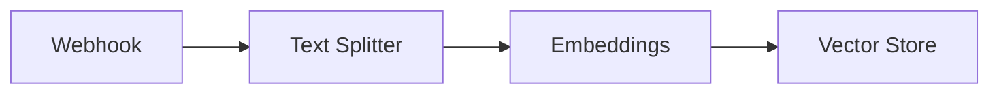

# 🔄 Flow de Mapeamento de Entidades

Este flow é responsável pelo processamento e indexação de entidades corporativas no sistema.

## 📋 Visão Geral

O flow de mapeamento de entidades recebe dados via webhook, processa e indexa as informações para uso posterior no chat corporativo. Ele é composto por três etapas principais:

1. **Recebimento de Dados**
   - Webhook para recebimento de payloads JSON
   - Validação e normalização dos dados
   - Extração de campos relevantes

2. **Processamento**
   - Divisão do texto em chunks
   - Geração de embeddings
   - Enriquecimento com metadados

3. **Indexação**
   - Armazenamento vetorial
   - Indexação semântica
   - Persistência de metadados

## 🛠️ Componentes

### WebhookComponent
- Recebe payloads JSON via HTTP POST
- Processa e normaliza os dados
- Garante campo `text` para embeddings
- Emite objeto `Data`

### TextSplitterComponent (a ser implementado)
- Divide textos longos em chunks
- Mantém contexto entre chunks
- Otimiza para processamento de embeddings

### EmbeddingsComponent (a ser implementado)
- Gera embeddings vetoriais
- Suporta diferentes modelos
- Otimiza para busca semântica

### VectorStoreComponent (a ser implementado)
- Armazena embeddings e metadados
- Suporta busca vetorial
- Gerencia índices semânticos

## 📊 Fluxo de Dados

## 🔧 Configuração

O flow é configurado através do arquivo `flow.json` que define:
- Conexões entre componentes
- Parâmetros de cada componente
- Configurações de processamento

## 📈 Próximos Passos

1. Implementar TextSplitterComponent
2. Desenvolver EmbeddingsComponent
3. Criar VectorStoreComponent
4. Adicionar validações e tratamento de erros
5. Implementar testes unitários 